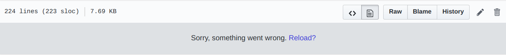
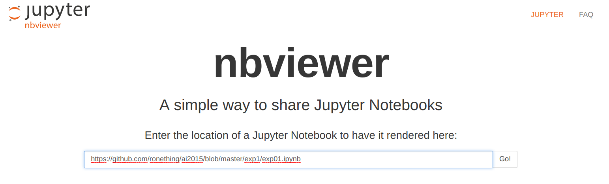

# SCAU-人工智能实验2015

notice

如果出现ipynb文件打不开的情况

建议用[nbviewer](https://nbviewer.jupyter.org/)打开

复制文件链接然后点击go即可

---

华农人工智能实验-仅供参考

- [实验一 最小二乘法](./exp1)
- [实验二 朴素贝叶斯](./exp2)
- [实验三 k近邻分类算法](./exp3)
- [实验四 k均值聚类算法](./exp4)
- [实验五 决策树](./exp5)
- [实验六 BP反向传播算法](./exp6)
- [实验七 Apriori算法](./exp7)
- [实验八 主成分分析降维](./exp8)

持续更新…
